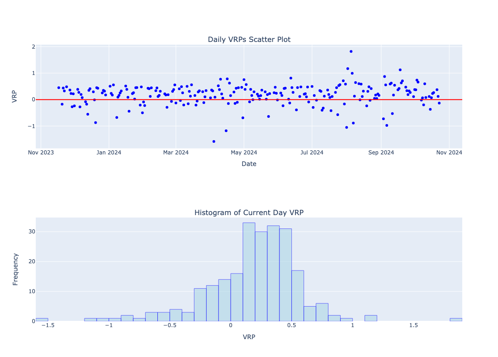
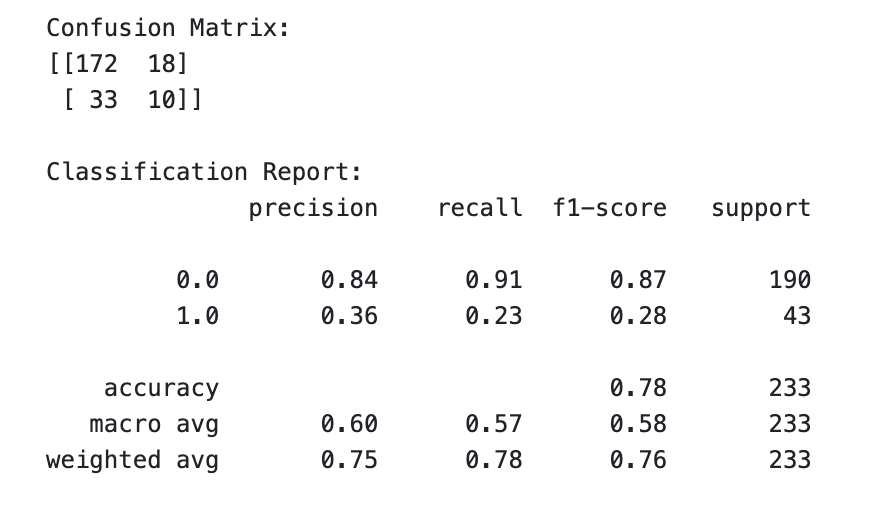
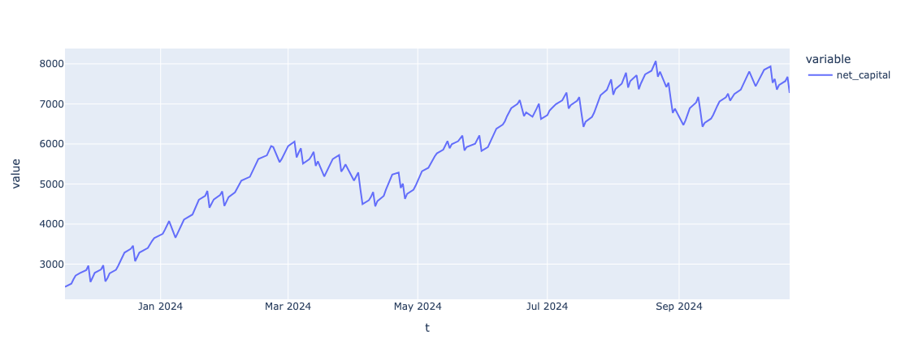

# Introduction

We introduce an elementary short volatility strategy on the S&P 500 and apply meta-labeling (as outlined in Lopez de Prado, *Advances in Financial Machine Learning*) to improve performance.

# Base Strategy Methodology:

Our primary strategy/model is relatively simple and aims to capture the volatility risk premium on the S&P 500 every day. We express this through selling an out-of-the-money, 0DTE credit spread. This means that as long as price doesn’t move enough/in the right direction to put these options in the money by the end of the trading day, we get to keep the premium we collected from selling the spread. The methodology for this strategy is as follows:

Every day, at 9:35 a.m. EST (this is our trade time instead of 9:30 market open to give price a moment to react to its overnight move / settle down), we:

1. Determine whether we’ll be selling a call or put spread. We’ll keep this part quite simple, using whether or not price is above its 20-day moving average as a rough proxy. If it’s above, we assume price is in a positive trend/regime and sell a put spread, expecting it to continue moving to the upside and vice versa. 
2. Determine how far out of the money to sell. We want to strike a balance of selling close enough to the money that we receive a sufficiently large premium for the risk we assume, but far enough from the money such that price is unlikely to be volatile enough to reach these levels. Given that we’re selling 0DTE options, the 1-day volatility index (VIX1D) is quite a good estimator of daily volatility. The value of the VIX1D represents a whole number percentage annualized implied move for the S&P 500, calculated using the implied volatilites of 0 and 1 DTE options on the index. Given that we're interested in the daily expected move, we deannualize this figure to obtain our implied move:

*Implied move = v / √252*, where:

   > *v* = price (value) of the VIX1D

 There are many ways to approximate realized volatility. For our purposes, we will calculate realized volatility as a whole number percentage (same unit as VIX1D) for our period of interest (trade time to market close) as:
   
 *Realized vol = (| pc - pt | / pt) * 100*, where:
   
  > *pt* = price at the time of the trade
 
  > *pc* = price at market close

We define the volatility risk premium for a given day as:

*VRP = Implied Move - Realized Vol*

If this figure is positive, it means that the VIX1D overestimated volatility and vice versa. Let's take a look at some plots over our backtest period (12/04/2023 - 10/25/2024):

### VRP Scatter and Histogram

We see from the scatter plot that the VRP is overwhelmingly positive, implying that the VIX1D often overestimates volatility. Specifically, over the backtest period, it overestimated ~76% of the time.

The histogram shows us that the VIX1D most often overestimates realized volatility by 0.3%-0.5%. The mean overestimation when it does overestimate is ~0.35%. The mean including the times where it underestimates is ~0.19%. This means that on a day where the VIX1D implies, say, a 1% move in the underlying, the true move is closer to 0.65%.

Again, we want to be close enough to the money in order for our collected premium to be large enough. Now knowing that the VIX1D tends to overestimate realized volatility quite often and substantially, we'll take a rather aggressive apporach and discount the implied move every day by 50%. For example, if the VIX1D implies a 100 basis point move, the strike of our short contract will be as close to 50 bps away from the current price as possible. We purchase a long contract 1 strike further out of the money than the short strike to hedge (giving us our "spread"), and that's our trade for the day. 

Many refer to this type of strategy as  “picking pennies up in front of a steamroller” because it has quite a high win rate but outsized losses. As we will later see in our backtest of this base strategy, we’ve won ~81% of the time. However, a corollary of such a high win rate is that the risk profile of this strategy is roughly 1:3.5, meaning that a single loss negates 3-4 wins. To improve performance, we will meta-label our model. 

# Meta-Labeling

Meta-labeling is a technique introduced by Dr. Marcos Lopez de Prado, who explains it far better than I ever could:

“Suppose that you have a model for setting the side of the bet (long or short). You just need to learn the size of that bet, which includes the possibility of no bet at all (zero size). This is a situation that practitioners face regularly. We often know whether we want to buy or sell a product, and the only remaining question is how much money we should risk in such a bet. We do not want the ML algorithm to learn the side, just to tell us what is the appropriate size. At this point, it probably does not surprise you to hear that no book or paper has so far discussed this common problem. Thankfully, that misery ends here. I call this problem meta-labeling because we want to build a secondary ML model that learns how to use a primary exogenous model.”

Thw high win rate but asymmetric risk profile of our strategy makes it an excellent candidate for meta-labeling/ Avoiding even a few of these outsized losses would vastly improve performance. In this case, our meta-model will be binarily discerning whether to trade or not on a given day. Should we trade, we’ll use a fixed size of 1 of each contract for simplicity’s sake.

We pull daily historical OHLCV data on the S&P 500 from Yahoo Finance (no need for a fancy API here) and derive price-based features (lagged returns, autocorrelation, indicators, etc.) for our secondary model. Since we trade near market open, we use opening prices to derive many features, such as moving averages. For those features which require info that could only be gained at the end of the trading session (such as a daily high or low), we lag these features by one timestep to avoid data leakage.

We then create our binary target for each day by seeing whether the base strategy had a winning trade. We label a row 0 for win (should have been traded) and 1 otherwise. Though it might sound counterintuitive, we label losing days, i.e. trades we should have avoided, with this 1 to make it the 'positive' class and what we hope to optimize for/predict correctly. This way, when we make our evaluation metric during model training recall, we will be evaluating our recall for identifying days on which we should have avoided trading, which is more important given the strategy's risk profile.

Now that we've preprocessed our features and target, we introduce a CatBoost classification model and make predictions on this data in a walk-forward manner. We first hyperparameter tune using purged k-fold cross validation, using an embargo period to prevent data leakage. Then, starting at the beginning of the backtest period, timestep *t*, we train our model on timesteps *t-150* to *t-1* and make a prediction as to whether we should have avoided trading on *t*, moving forward by one timestep each iteration. 

Once we've generated predictions, we can compare against the actual target variables using some classification metrics:

As we can see, the model does a good job of identifying days on which we should trade, with an F1 score of 0.83 and recall of 0.82. However, these scores for identifying the positive class (avoid trading) are much lower. This is largely due to the class imbalances in our training set, which is a corollary of the already high win rate of the base strategy. While we could certainly use techniques like SMOTE, further increase the weights of the minority class, or assymetrically threshold what prediction probability constitutes the positive class to increase the recall on this minority class, dogin so would likely come at the overwhelming cost of our precision/recall for the majority (do trade) class and our overall f1 score. Again, since this strategy's losses are so outsized, catching even ~1/4 of them while still identifying the vast majority of days on which we should trade significantly improves performance.

Let's now take a look at backtests for the base and meta-labeled strategies.

# Backtests

## Base Strategy Backtest

### Equity Curve and Performance Metrics

Sharpe Ratio: 2.25

Win Rate: 81.17%

Average Win: $107.79

Average Loss: $357.63

Expected Value Per Trade: $20.13   

Some notes about these metrics: 

1. In the Sharpe Ratio calculation, we assume a risk-free rate of 4% (0.04).
2. We've defined our expected value per trade (in dollars) as:

*EV = (WR * AW) - ((1 - WR) * AL)*, where:

> *WR* = The strategy's win rate
 
> *AW* = The average profit of a winning trade

> *AL* = The average loss of a losing trade

## Meta-labeled Strategy Backtest
### Equity Curve and Performance Metrics

Sharpe Ratio: 3.54

Win Rate: 82.78%

Average Win: $108.46

Average Loss: $342.89

Expected Value Per Trade: $30.73

# Conclusion

Summarizing, meta-labeling has:

Increased Sharpe by 57.33%

Increased win rate by 1.61%

Increased average win by 0.62%

Decreased average loss by 4.12%

Increased EV per trade by 52.66%

Note that the Sharpes for both the base and labeled strategies are quite steep and likely inflated by some of the more lenient assumptions I've made. 

At any rate, we see a far smoother equity curve upon applying this meta-model, and the improvement metrics speak for themselves.

Future steps include building a more robust ML pipeline (further analysis of features/feature importance, feature transforms, better handling of class imabalance, etc.), dynamically adjusting position sizing, experimenting with different implied move discounts, and finding a more effective way to determine direction (but if doing so were easy, then we’d all be rich ;))
